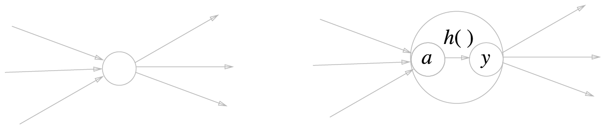

# Chapter3. 신경망 Neural Network
복잡한 처리를 퍼셉트론으로 표현할 수 있지만, 가중치를 설정하는 작업은 사람이 해야했다. 
신경망은 데이터를 통해 가중치 매개변수의 적절한 값을 학습한다. 

\* 이번 장에서 알아볼 내용 : 신경망 개요, 입력 데이터가 무엇인지 식별하는 처리 과정

## 3.1 퍼셉트론에서 신경망으로
### 3.1.1 신경망의 예
신경망의 표현 : 입력층 - 은닉층 - 출력층

뉴런이 연결되는 방식은 퍼셉트론과 다르지 않다.

### 3.1.2 퍼셉트론 복습
### 3.1.3 활성화 함수 activation function
activation function 활성화 함수 : 입력 신호의 총합을 출력 신호로 변환하는 함수 
= 입력 신호의 총합이 활성화를 일으키는지 정하는 역할을 한다.

~~~
a = b + $w_1$$x_1$ + $w_2$$x_2$
y = h(a)
~~~

\* 일반적으로 단순 퍼셉트론은 단층 네트워크에서 계단 함수를 활성화 함수로 사용한 모델을 가리킴 
(계단 함수 step function : 임계값을 경계로 출력이 바뀌는 함수)

\* 다층 퍼셉트론은 신경망을 가리킴 
(신경망 : 여러 층으로 구성되고 시그모이드 함수 등의 매끈한 활성화 함수를 사용하는 네트워크)

## 3.2 활성화 함수
### 3.2.1 시그모이드 함수 sigmoid function
자연상수 e를 써서 계단함수와는 다르게 연속된 값을 출력한다.
~~~
h(x) = 1 / (1 + exp(-x))
~~~

### 3.2.2, 3.2.3 계단 함수 구현, 그래프
### 3.2.4, 3.2.5 시그모이드 함수, 계단함수와의 비교
StepAndSigmoidFunction.py

\* 차이점 : 계단함수는 0 or 1 값만 돌려주지만 시그모이드 함수는 그 사이 연속적인 실수를 돌려준다. 
\* 공통점 : 입력이 중요하면 큰 값을 출력하고, 그렇지 않으면 작은 값을 출력한다. 입력은 0과 1사이(포함)에 있다. 비선형 함수이다.

### 3.2.6 비선형 함수
선형 함수의 문제 : 층을 아무리 쌓아도 제곱의 형태가 되기 때문에 결국 단층으로 표현 가능하다. (= 선형으로는 원하는 기능 구현이 안된다.)

### 3.2.7 ReLU함수 렐루함수 Rectified Linear Unit
최근에는 신경망 분야에서 렐루함수를 주로 이용하고 있음.

입력이 0을 넘으면 그 입력을 그대로 출력하고, 0 이하이면 0을 출력한다. 
~~~python
def relu(x):
    return np.maximum(0, x)
~~~
(시그모이드랑 비교해서 무슨 장점이 있는지는 아직 안나왔다.)

## 3.3 다차원 배열의 계산
CalcMultiDimensionalArray.py

## 3.4 3층 신경망 구현하기
### 3.4.1 표기 설명
\* 중요 사항 : 신경망에서의 계산을 행렬 계산으로 정리할 수 있다. 각 층의 계산은 행렬의 곱으로 처리할 수 있다.

### 3.4.2, 3.4.3 구현하기
NeuralNetwork.py

## 3.5 출력층 설계하기
\* 분류 classification : 데이터가 어느 클래스에 속하느냐? - 일반적으로 소프트맥스 함수 사용 
\* 회귀 regression : 입력 데이터에서 (연속적인) 수치를 예측하는 문제 - 일반적으로 항등 함수 사용

### 3.5.1 항등 함수와 소프트맥스 함수 구현하기
항등 함수 identity function : 입력을 그대로 출력한다.

소프트맥스 함수 softmax function

위 수식을 코드로 구현하면 아래와 같으나, 오버플로 문제가 발생한다.
~~~python
def softmax(a):
    exp_a = np.exp(a)
    sum_exp_a = np.sum(exp_a)
    y = exp_a / sum_exp_a

    return y
~~~

### 3.5.2 소프트맥스 함수 구현시 주의점
컴퓨터에서 수를 표현하기 위한 비트수가 유한하기 때문에, 너무 큰 값은 표현할 수 없고 오버플로 문제가 발생한다.

이 문제를 해결하기 위해서는 수를 컴퓨터가 다룰 수 있는 범위 내에 있도록 조정하여 유지해주는것이 필요하다. 
(아래 수식 참조)

C' 값에는 어느 값을 대입해도 상관없지만, 오버플로를 막을 목적으로는 입력 신호 중 최댓값을 이용하는것이 일반적이다.

### 3.5.3 소프트맥스 함수의 특징
소프트맥스 함수 출력의 총합은 1이다.  
이 성질 덕분에 소프트맥스 함수의 출력을 '확률'로 해석할 수 있다. (= 소프트맥스 함수를 이용하여 문제를 확률적, 퉁계적으로 대응할 수 있게 된다.)

주의점 : 소프트맥스 함수를 적용해도 각 원소의 대소 관계는 변하지 않는다. (지수함수가 단조 증가이기 때문)

신경망을 이용한 분류에서는 일반적으로 가장 큰 출력을 내는 뉴런에 해당하는 클래스로만 인식한다. 
그리고 소프트맥스 함수를 적용해도 그 위치는 달라지지 않는다. 
=> 결론적으로 신경망으로 분류를 할 때 추론과정에는 소프트맥스 함수를 생략해도 된다. (결과가 동일하므로. 추론 과정에서는 사용하지 않더라도 문제 풀이를 위한 학습과정에서는 사용한다.)

### 3.5.4 출력층의 뉴런 수 정하기

## 3.6 손글씨 숫자 인식
실전! 손글씨 숫자를 분류해보자. classification

학습 과정은 생략하고, 추론 과정(신경망의 순전파, foward propagation)만 구현해보자.

[등장한 개념, 용어]
* (훈련 이미지, 훈련 레이블), (시험 이비지, 시험 레이블)
* one-hot encoding
* python pickle
* accuracy 정확도
* normalization 정규화
* pre-processing 전처리
* whitening 백색화
* batch 배치

MNISTExcercise.py

## 3.7 정리
살펴본 것 : 신경팡의 순전파, 활성화 함수 
활성화 함수 : 계단 함수, 시그모이드 함수, 렐루 함수, 항등 함수, 소프트맥스 함수

신경망을 효율적으로 구현하는 법 : 넘파이의 다차원 배열을 잘 활용해보자.

분류에서는 출력층의 뉴런 수를 분류하려는 클래스 수와 같게 설정한다. 
입력 데이터를 묶은 것을 배치라 하고, 추론 처리를 이 배치 단위로 진행하면 결과를 훨씬 빠르게 얻을 수 있다.
 